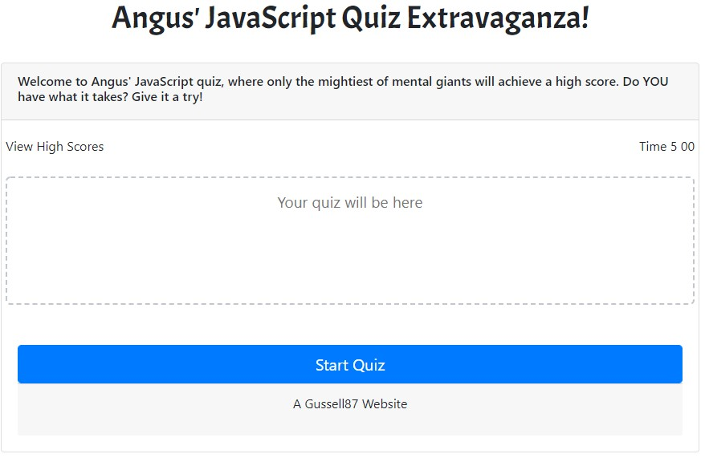

JavaScript Quiz Extravaganza!

Project
Aim is to produce a timed quiz, with 8 questions related to JavaScrtipt. The user will land on a home page, and click a button to start the quiz.
When they click start, the clock will begin counting down from 5 minutes. They will be presented with a question and 4 answer alternatives to click.
If they click the correct answer, the clock continues counting down as normal and they move onto the next question. The word correct will appear onscreen.
They they answer incorrectly, the word wrong will appear onscreen. They will move onto the next question as above, however 20 seconds will be deducted from the clock.
This will repeat 8 times.
When the clock reaches 0, the quiz will stop. User will be informed they did not record a time, and be returned to the homepage.
If the user finishes all 8 questions before time's up, the quiz will stop. They will receive a congratulatory message. Their remaining time will be recorded and listed as a high score, and they will be prompted to enter their name (up to 15 characters). They will be returned to the homepage.
A separate page, High Scores, will then feature their high score in local storage.

Build status as of: 11/6/20
HTML homepage: 100%
HTML high scores page: 100%
JavaScript: 40%
CSS: 100% (will grow with other pages)

JavaScript Questions:
0. In what year was JavaScript first introduced?
a. 1993
b. 1995 - Correct
c. 1999
d. 2001

1. JavaScript was first developed to add programs to webpages in which browser?
a. Internet Explorer
b. OmniWeb
c. Mozilla
d. Netscape Navigator - correct

2. What to Java and JavaScript have in common as programming languages?
a. Very little. JavaScript was named as a marketing ploy to try to leverage some of Java's growing popularity. - Correct
b. They were developed by the same company.
c. The two can be used interchangeably for the same processes.
d. The two can be used together for complementary processes.

3. What other name can be used interchangeably with JavaScript?
a. Java
b. HTML
c. BrowserScript
d. ECMAScript - correct

4. How many bits does JavaScript use to store a single number value?
a. 4
b. 16
c. 64 - correct
d. 128

5. What is the appoximate largest whole number that can be stored in JavaScript?
a. 256 billion
b. 64 trillion
c. 9 quadrillion - correct
d. 18 quintillion

6. The % sign represents which arithmetic operator?
a. Remainder - correct.
b. Percentage of
c. Division
d. Is less than

7. What symbol would you type before a declaration to indicate it is not true?
a. ?
b. -
c. /
d. ! - correct

Page layouts

HTML Home Page
All items centered.
H1 header.
Card format containing the rest of the contents on the page. 70-80% width of the page. Dymanic for different formats using Bootsrap.
Top box with introduction & intructions across width of the box. Slightly darker background.
3 column row with link to high scores on the left, and timer on the right.
Marked, dashed line box that will contain questions and answers. Faded text to indicate this is the case.
Large, blue button to start the quiz.
Card footer.

When

HTML High Scores
Same format as above. Difference is content: title, description, link goes home, scores appear instead of questions, remove button.

CSS
Separate styling required for header font, container, time elements, text alignment within columns, quiz area.

JavaScript
